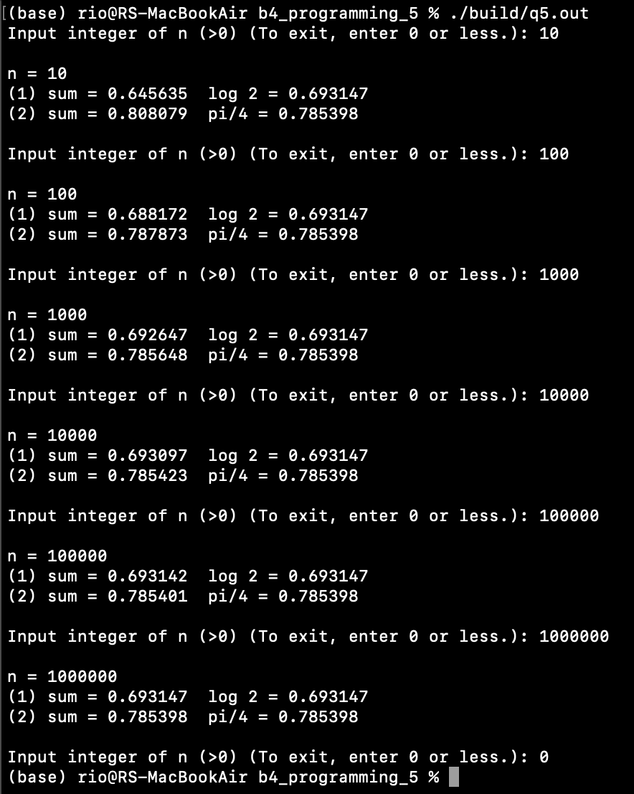

# 問5
func.c
## function:func1
returns: $\displaystyle\sum^{n}_{m=1}{\dfrac{(-1)^{m-1}}{m}}$  
Arg1: $n\in\mathbb{N}$
```
double func1(int n){
	double sum = 0;
	for(int m = 1; m <= n; m++){
		sum += pow(-1,m-1) / m;
	}
	return sum;
}
```

## function:func2
returns: $\displaystyle\sum^{n}_{m=0}{\dfrac{(-1)^{m}}{2m+1}}$  
Arg1: $n\in\mathbb{N}$

```
double func2(int n){
	double sum = 0;
	for(int m = 0; m <= n; m++){
		sum += pow(-1, m) / (2 * m + 1); 
	}
	return sum;
}
```

